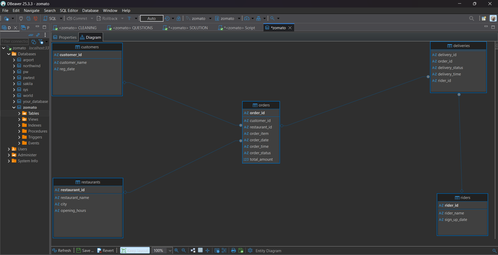
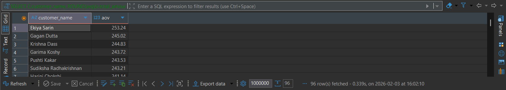
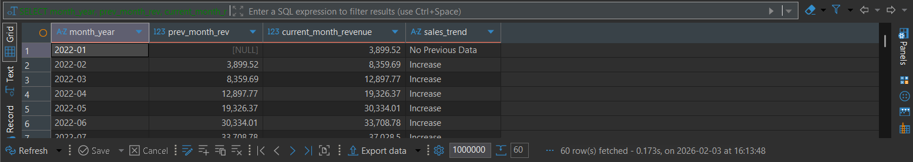
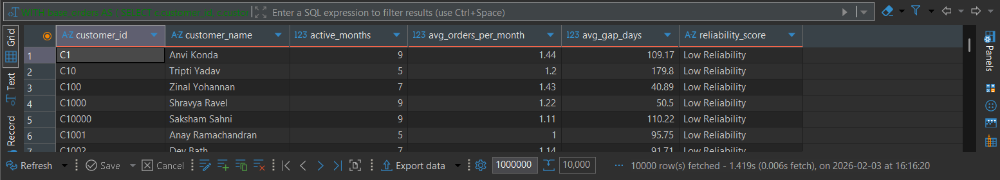

<div align="center">

# 🍽️ Zomato SQL Analytics Project
### *Transforming Food Delivery Data into Actionable Business Intelligence*


</div>


## 📋 Project Overview

This is a comprehensive SQL analytics project focused on analyzing Zomato’s food delivery data to uncover actionable business insights.  
The project examines **customer behavior**, **revenue and growth trends**, **restaurant performance**, and **operational efficiency** using advanced SQL techniques.

The goal of this project is to simulate **real-world, industry-level data analysis**, transforming raw transactional data into meaningful insights that support strategic and operational decision-making.

---

## 🧩 Entity Relationship Diagram (ER Diagram)

The following ER diagram represents the relational structure of the Zomato food delivery database.  
It illustrates how **customers**, **restaurants**, **orders**, **deliveries**, and **riders** are interconnected using **primary keys** and **foreign keys**.



### 🔗 Relationship Overview
- **Customers → Orders** (One-to-Many)
- **Restaurants → Orders** (One-to-Many)
- **Orders → Deliveries** (One-to-One / One-to-Many)
- **Riders → Deliveries** (One-to-Many)

### 🧠 Design Rationale
- The **Orders** table acts as the central transactional entity
- Referential integrity is enforced using foreign key constraints
- The schema supports advanced analytics such as revenue trends, churn analysis, rider performance, and customer segmentation

This ER design enables scalable, real-world SQL analytics similar to production-grade food delivery platforms like Zomato.

---

## 📊 SQL Queries & Outputs

### **Query 1: Top 3 Dishes by Customer**

**Question:** Determine the top three most frequently ordered dishes by the customer Indrajit Gara over the last 12 months, based on total order frequency.

```sql
SELECT customer_name,
       dishes,
       Total_orders
       FROM
(SELECT c.customer_id,
       c.customer_name,
       o.order_item dishes,
       Count(*) Total_orders,
       DENSE_RANK() OVER(ORDER BY Count(*)) as Ranks
FROM orders o
JOIN customers c
ON o.customer_id = c.customer_id
WHERE o.order_date >= CURRENT_DATE - INTERVAL 1 YEAR 
      AND
      c.customer_name = "Indrajit Gara"
GROUP BY 1,2,3
ORDER BY 4 DESC) as t
WHERE Ranks <= 3;
```


## Output:


## 🧠 Insight

- **Customer "Indrajit Gara" shows a strong preference for a small set of dishes**
- **Multiple dishes share the same highest order frequency (tied top ranks)**
- **Consistent repeat ordering behavior indicates strong customer loyalty**

## 💼 Business Use Case

- **Top dishes can be bundled or offered with personalized discounts** to increase retention
- **High-demand dishes should be prioritized in inventory planning**
- **Ordering patterns can be leveraged in recommendation systems** to optimize sales

---

### **Query 2: Peak Time Slots**

**Question:** Analyze order volume distribution across 2-hour time slots to identify peak ordering periods on the Zomato platform.

```sql
SELECT 
	  FLOOR(EXTRACT(HOUR FROM order_time)/2)*2 as Start_Time,
      FLOOR(EXTRACT(HOUR FROM order_time)/2)*2 + 2 as End_Time,
      COUNT(*) as Total_Order
FROM orders
GROUP BY 1,2
ORDER BY 3 DESC;
```

**Output:**


## 🧠 Insight

- **Order volume peaks during the 14:00–16:00 and 20:00–22:00 time slots**
- **These periods represent high demand during lunch and late-evening hours**
- **Customer ordering behavior shows clear time-based consumption patterns on Zomato**

## 💼 Business Use Case

- **Peak time windows can be leveraged for dynamic pricing and flash offers**
- **Restaurants can run targeted promotions during high-demand slots**
- **Zomato can optimize delivery partner allocation and ETA predictions** to improve customer experience

---

### **Query 3: High-Frequency Customer AOV**

**Question:** Evaluate the Average Order Value (AOV) of customers on the Zomato platform who have placed more than 20 orders, and rank these high-frequency customers based on their AOV.

```sql
SELECT 
    C.customer_name,
    ROUND(avg(o.total_amount),2) aov
FROM orders o
JOIN customers c
ON o.customer_id = c.customer_id
GROUP BY 1
HAVING COUNT(order_id) > 20
ORDER BY 2 DESC;
```

**Output:**



## 🧠 Insight

- **Customers with more than 20 orders show a consistently higher Average Order Value (AOV)**
- **Repeat customers contribute disproportionately to overall revenue on Zomato**
- **High order frequency is strongly correlated with long-term revenue generation**

## 💼 Business Use Case

- **Such users can be tagged as High-Value Customers (HVCs)**
- **Personalized recommendations, premium memberships (Zomato Gold), and upsell strategies** can be designed to increase Customer Lifetime Value (CLV)
- **Reinforces the strategy that customer retention drives sustainable revenue growth** more effectively than one-time acquisition

---


### **Query 4: VIP Customers (₹5000+ Spend)**

**Question:** Identify high-value customers on the Zomato platform who have spent more than ₹5,000 on food orders, and rank them based on their total lifetime spend.

```sql
SELECT 
    c.customer_name,
    c.customer_id,
    ROUND(SUM(o.total_amount),0) AS total_amount
FROM customers c
JOIN orders o
    ON c.customer_id = o.customer_id
GROUP BY 
    c.customer_name,
    c.customer_id
HAVING SUM(o.total_amount) > 5000
ORDER BY total_amount DESC
LIMIT 5;
```

**Output:**


## 🧠 Insight

- **A small group of customers contributes significantly to total revenue**, with each spending over **₹5,000 on food orders**
- **These high-value users drive disproportionate revenue** on the Zomato platform
- **Revenue concentration is skewed toward a limited set of power users**

## 💼 Business Use Case

- **Such users can be tagged as VIP / Power Users**
- **Ideal targets for Zomato Gold, exclusive coupons, and priority delivery**
- **Supports a CLV-focused strategy (Customer Lifetime Value)** rather than relying only on order volume

---

### **Query 5: Non-Delivered Orders by Restaurant**

**Question:** Identify restaurants on the Zomato platform with orders that were placed but not delivered, and analyze the volume of non-delivered orders at the restaurant level.

```sql
SELECT 
    r.restaurant_name,
    COUNT(o.order_id) AS cnt_not_delivered_orders
FROM
    orders o
        LEFT JOIN
    restaurants r ON o.restaurant_id = r.restaurant_id
        LEFT JOIN
    deliveries d ON o.order_id = d.order_id
WHERE
    d.delivery_id IS NULL
GROUP BY 1
ORDER BY 2 DESC;
```

**Output:**


## 🧠 Insight

- **Certain restaurants exhibit a significantly higher number of non-delivered orders**
- **This indicates potential operational bottlenecks, delivery partner shortages, or restaurant-level inefficiencies**
- **Non-delivery patterns highlight risk areas impacting customer experience**

## 💼 Business Use Case

- **Such restaurants can be flagged for operational audits and performance reviews**
- **Zomato can optimize delivery partner allocation, ETA accuracy, and onboarding quality checks**
- **Reducing non-delivered orders improves customer trust, platform ratings, and repeat usage**

---

### **Query 6: Top Revenue Restaurant per City**

**Question:** Rank restaurants on the Zomato platform by their total revenue generated over the past year, and identify the top-revenue-generating restaurant within each city.


```sql
SELECT 
    city,
    restaurant_id,
    restaurant_name,
    Total_Rev
FROM (
    SELECT
        r.city,
        r.restaurant_id,
        r.restaurant_name,
        ROUND(SUM(o.total_amount), 0) AS Total_Rev,
        RANK() OVER (
            PARTITION BY r.city 
            ORDER BY ROUND(SUM(o.total_amount), 0) DESC
        ) AS Ranks
    FROM orders o
    JOIN restaurants r 
        ON o.restaurant_id = r.restaurant_id
    WHERE o.order_date >= CURRENT_DATE - INTERVAL 1 YEAR
    GROUP BY r.city, r.restaurant_id, r.restaurant_name
) Restaurant_Revenue_Ranking
WHERE Ranks = 1
ORDER BY city;
```

**Output:**


## 🧠 Insight (Revenue & City Performance)

- **Each city has a distinct top revenue–generating restaurant**
- **Revenue leadership is highly localized rather than dominated by a single national player**
- **City-wise performance highlights strong local champions on the Zomato platform**

## 💼 Business Use Case

- **Top-earning restaurants in each city can be featured for promotions and visibility boosts**
- **Helps Zomato identify city-wise flagship partners**
- **Supports commission optimization, premium placement, and long-term partnership strategies**

---

### **Query 7: Most Popular Dish per City**

**Question:** Identify the most popular dish in each city on the Zomato platform based on total order volume, to understand regional food preferences.

```sql
SELECT city, order_item, Total_Orders
FROM (
    SELECT 
        r.city,
        o.order_item,
        COUNT(o.order_id) AS Total_Orders,
        RANK() OVER (
            PARTITION BY r.city 
            ORDER BY COUNT(o.order_id) DESC
        ) AS Rank_by_city
    FROM restaurants r
    JOIN orders o 
        ON r.restaurant_id = o.restaurant_id
    GROUP BY r.city, o.order_item
) ranked_data
WHERE Rank_by_city = 1
ORDER BY city;
```

**Output:**


## 🧠 Insight (City-Level Demand Analytics)

- **Food preferences vary significantly across cities**, with different dishes dominating order volumes in different regions
- **This highlights strong regional taste patterns** among Zomato users
- **City-level demand analytics reveal localized consumption behavior**

## 💼 Business Use Case

- **Enables city-specific menu recommendations and personalized home screens**
- **Supports localized marketing campaigns** (e.g., “Mumbai loves Idli Sambar”)
- **Helps restaurant partners optimize menus** based on city-wise demand patterns

---

### **Query 8: Churned Customers (2024→2025)**

**Question:** Identify customers on the Zomato platform who were active in 2024 but have not placed any orders in 2025, to analyze potential customer churn.
 
```sql
SELECT DISTINCT
    c.customer_id,
    c.customer_name
FROM orders o
JOIN customers c
    ON c.customer_id = o.customer_id
WHERE EXTRACT(YEAR FROM o.order_date) = 2024
  AND NOT EXISTS (
        SELECT 1
        FROM orders o2
        WHERE o2.customer_id = o.customer_id
          AND EXTRACT(YEAR FROM o2.order_date) = 2025
  )
ORDER BY 1;
```

**Output:**


## 🧠 Insight (Churn & Retention Focused)

- **A significant set of previously active customers did not return in the following year**
- **This indicates potential customer churn** driven by experience issues, pricing sensitivity, or competitive alternatives
- **Year-over-year activity drop highlights retention gaps** on the Zomato platform

## 💼 Business Use Case

- **Such users can be targeted with win-back campaigns, personalized offers, or reactivation notifications**
- **Helps Zomato quantify retention gaps and prioritize retention strategies** over new customer acquisition
- **Directly feeds into CLV, cohort analysis, and long-term growth planning**

---

### **Query 9: Year-over-Year Cancellation Rates**

**Question:** Analyze and compare year-over-year order cancellation rates for restaurants on the Zomato platform to identify operational performance trends

```sql
WITH cancellation_data_25 AS (
    SELECT
        o.restaurant_id,
        r.restaurant_name,
        COUNT(o.order_id) AS total_orders,
        SUM(
            CASE
                WHEN d.delivery_id IS NULL THEN 1
                ELSE 0
            END
        ) AS cancelled_orders
    FROM orders o
    LEFT JOIN deliveries d
        ON o.order_id = d.order_id
    LEFT JOIN restaurants r
        ON o.restaurant_id = r.restaurant_id
    WHERE YEAR(o.order_date) = 2025
    GROUP BY
        o.restaurant_id,
        r.restaurant_name
),
Last_Year_Data AS (
    SELECT
        restaurant_id,
        restaurant_name,
        total_orders,
        cancelled_orders,
        ROUND((cancelled_orders / NULLIF(total_orders, 0)) * 100, 2) AS cancellation_rate_2025
    FROM cancellation_data_25
),
cancellation_data_26 AS (
    SELECT
        o.restaurant_id,
        r.restaurant_name,
        COUNT(o.order_id) AS total_orders,
        SUM(
            CASE
                WHEN d.delivery_id IS NULL THEN 1
                ELSE 0
            END
        ) AS cancelled_orders
    FROM orders o
    LEFT JOIN deliveries d
        ON o.order_id = d.order_id
    LEFT JOIN restaurants r
        ON o.restaurant_id = r.restaurant_id
    WHERE YEAR(o.order_date) = 2026
    GROUP BY
        o.restaurant_id,
        r.restaurant_name
),
Current_Year_Data AS (
    SELECT
        restaurant_id,
        restaurant_name,
        total_orders,
        cancelled_orders,
        ROUND((cancelled_orders / NULLIF(total_orders, 0)) * 100, 2) AS cancellation_rate_2026
    FROM cancellation_data_26
)
SELECT
    l.restaurant_id,
    l.restaurant_name,
    l.cancellation_rate_2025,
    c.cancellation_rate_2026,
    ROUND(
        c.cancellation_rate_2026 - l.cancellation_rate_2025,
        2
    ) AS rate_difference
FROM Last_Year_Data l
LEFT JOIN Current_Year_Data c
    ON l.restaurant_id = c.restaurant_id;
```

**Output:**


## 🧠 Insight (Operations & Quality Control)

- **Cancellation rates vary significantly across restaurants year-over-year**
- **Some restaurants show clear improvement, while others experience rising cancellations**
- **This indicates inconsistent operational reliability at the restaurant level**

## 💼 Business Use Case

- **Restaurants with increasing cancellation rates can be flagged for operational audits or delivery partner realignment**
- **Restaurants showing improvement can be rewarded with higher platform visibility**
- **Monitoring cancellation trends helps protect customer trust, ratings, and long-term retention**

---

### **Query 10: Average Delivery Time per Rider**

**Question:** Calculate the average delivery time for each delivery partner (rider) on the Zomato platform to evaluate rider performance and delivery efficiency.

```sql
SELECT
    r.rider_id,
    r.rider_name,
    SEC_TO_TIME(
        AVG(
            TIMESTAMPDIFF(
                SECOND,
                CONCAT(o.order_date, ' ', o.order_time),
                CONCAT(o.order_date, ' ', d.delivery_time)
            )
        )
    ) AS avg_delivery_time
FROM riders r
JOIN deliveries d
    ON r.rider_id = d.rider_id
JOIN orders o
    ON d.order_id = o.order_id
WHERE d.delivery_status = 'Delivered'
GROUP BY
    r.rider_id,
    r.rider_name
ORDER BY
    avg_delivery_time;
```

**Output:**


## 🧠 Insight (Rider Performance & Delivery Efficiency)

- **Average delivery times are largely consistent across riders**
- **A small performance gap exists between the fastest and slowest delivery partners**
- **This reflects a generally stable last-mile delivery operation with minor efficiency variations**

## 💼 Business Use Case

- **High-performing riders can be prioritized during peak demand periods and rewarded through incentive programs**
- **Slower riders can be supported with route optimization, workload balancing, or targeted training**
- **Tracking rider-wise delivery time trends improves ETA accuracy, customer satisfaction, and SLA compliance**

---

### **Query 11: Month-over-Month Restaurant Growth**

**Question:** Analyze the month-over-month growth ratio of delivered orders for each restaurant on the Zomato platform to evaluate demand trends and restaurant performance over time.

```sql
WITH monthly_orders AS (
    SELECT
        o.restaurant_id,
        MAX(r.restaurant_name) AS restaurant_name,
        DATE_FORMAT(o.order_date, '%m-%y') AS month,
        COUNT(o.order_id) AS cnt_orders,
        STR_TO_DATE(DATE_FORMAT(o.order_date, '%Y-%m-01'), '%Y-%m-%d') AS sort_month
    FROM orders o
    JOIN deliveries d
        ON d.order_id = o.order_id
    JOIN restaurants r
        ON r.restaurant_id = o.restaurant_id
    WHERE d.delivery_status = 'Delivered'
    GROUP BY
        o.restaurant_id,
        month,
        sort_month
),
final_data AS (
    SELECT
        restaurant_id,
        restaurant_name,
        month,
        cnt_orders AS current_month_orders,
        sort_month,
        LAG(cnt_orders, 1) OVER (
            PARTITION BY restaurant_id
            ORDER BY sort_month
        ) AS prev_month_orders
    FROM monthly_orders
)
SELECT
    restaurant_id,
    restaurant_name,
    month,
    current_month_orders,
    prev_month_orders,
    ROUND(
        (current_month_orders / NULLIF(prev_month_orders, 0) - 1),
        2
    ) AS growth_ratio
FROM final_data
ORDER BY restaurant_id, sort_month;
```

**Output:**


## 🧠 Insight (Restaurant Growth & Demand Trends)

- **Monthly order volumes for restaurants exhibit fluctuating growth patterns**
- **Periods of acceleration and decline indicate demand variability**
- **Demand changes are influenced by seasonality, promotions, and restaurant-level operational performance**

## 💼 Business Use Case

- **Restaurants with sustained positive growth can be prioritized for premium placements and marketing campaigns**
- **Restaurants showing consecutive negative growth can be flagged for intervention** through menu optimization or targeted promotions
- **Tracking growth ratios enables early detection of declining partners** and supports proactive retention and revenue optimization

---

### **Query 12: Customer Segmentation (Gold vs Silver)**

**Question:** Segment customers on the Zomato platform into ‘Gold’ and ‘Silver’ categories based on their total spending compared to the overall Average Order Value (AOV), and analyze each segment’s order volume and revenue contribution.

```sql
WITH customer_spend AS (
    SELECT
        c.customer_id,
        c.customer_name,
        SUM(o.total_amount) AS total_spent,
        COUNT(o.order_id) AS total_orders
    FROM customers c
    JOIN orders o
        ON c.customer_id = o.customer_id
    WHERE o.order_status = 'Delivered'
    GROUP BY
        c.customer_id,
        c.customer_name
),
avg_order_value AS (
    SELECT
        AVG(total_amount) AS aov
    FROM orders
    WHERE order_status = 'Delivered'
)
SELECT
    cs.customer_id,
    cs.customer_name,
    cs.total_orders,
    cs.total_spent,
    CASE
        WHEN cs.total_spent >= aov THEN 'Gold'
        ELSE 'Silver'
    END AS segment
FROM customer_spend cs
CROSS JOIN avg_order_value
ORDER BY cs.total_spent DESC;

```

**Output:**


## 🧠 Insight (Customer Segmentation – Gold vs Silver)

- **The ‘Gold’ customer segment shows consistently high order frequency and total spending**
- **This indicates strong engagement and repeat purchasing behavior**
- **Despite being a smaller segment, Gold customers contribute a disproportionately large share of total revenue**

## 💼 Business Use Case

- **Gold customers should be prioritized for premium loyalty programs, personalized offers, and priority delivery**
- **Retention of the Gold segment is critical**, as churn here would significantly impact overall platform revenue
- **Gold customer behavior can inform upsell strategies** to convert high-potential Silver users into the Gold segment

---

### **Query 13: Monthly Rider Earnings**

**Question:** Calculate the monthly earnings of each delivery partner (rider) on the Zomato platform, assuming riders earn a fixed 8% commission per delivered order, to analyze income distribution and rider productivity over time.

```sql
SELECT
    r.rider_id,
    r.rider_name,
    DATE_FORMAT(o.order_date, '%Y-%m') AS month_year,
    SUM(o.total_amount * 0.08) AS monthly_earnings
FROM riders r
JOIN deliveries d
    ON r.rider_id = d.rider_id
JOIN orders o
    ON d.order_id = o.order_id
WHERE d.delivery_status = 'Delivered'
GROUP BY
    r.rider_id,
    r.rider_name,
    month_year
ORDER BY
    3,4;
```

**Output:**


## 🧠 Insight (Rider Earnings & Incentive Planning)

- **Monthly rider earnings vary significantly**
- **Earnings differences are driven by order volume, delivery frequency, and engagement levels**
- **Some riders consistently generate higher earnings, indicating stronger productivity and availability**

## 💼 Business Use Case

- **High-earning riders can be identified as top performers** and rewarded through incentive programs or priority order allocation
- **Riders with lower or inconsistent earnings can be supported** through better shift allocation, zone optimization, or performance assistance
- **Tracking rider earnings trends supports fair payout structures**, improves rider retention, and balances supply–demand across regions

---

### **Query 14: Rider Performance Rating**

**Question:** Analyze rider performance on the Zomato platform by categorizing deliveries into 5-star, 4-star, and 3-star ratings based on delivery time thresholds, and calculate the distribution of ratings for each rider.

```sql
WITH delivery_time AS (
    SELECT
        r.rider_id,
        r.rider_name,
        SEC_TO_TIME(
            TIME_TO_SEC(d.delivery_time) - TIME_TO_SEC(o.order_time)
        ) AS total_time
    FROM orders o
    JOIN deliveries d
        ON o.order_id = d.order_id
    JOIN riders r
        ON d.rider_id = r.rider_id
),
rider_rating as (

SELECT
    rider_id,
    rider_name,
    total_time,
    CASE
        WHEN (TIME_TO_SEC(total_time) / 60) < 25 THEN '5 star'
        WHEN (TIME_TO_SEC(total_time) / 60) >= 25
             AND (TIME_TO_SEC(total_time) / 60) < 35 THEN '4 star'
        ELSE '3 star'
    END AS riders_rating
FROM delivery_time)

select rider_id,
    rider_name,
    riders_rating,
    COUNT(riders_rating) rating_count
    from rider_rating
group by 1,2,3
order by 2;
```

**Output:**


## 🧠 Insight (Rider Performance & Quality Control)

- **Rider ratings based on delivery time vary noticeably across delivery partners**
- **Some riders consistently achieve higher ratings, while others receive a higher share of low ratings**
- **This reflects differences in delivery efficiency, route familiarity, and workload management**

## 💼 Business Use Case

- **Riders with a higher proportion of 5-star ratings can be identified as top performers** and rewarded through incentives or priority order allocation
- **Riders with frequent 3-star ratings can be supported** via route optimization, zone reassignment, or targeted training programs
- **Rating-based performance tracking helps maintain delivery quality standards** and improves overall customer satisfaction

---

### **Query 15: Peak Ordering Day per Restaurant**

**Question:** Analyze day-wise order frequency for each restaurant on the Zomato platform and identify the peak ordering day of the week to understand demand patterns.


```sql
WITH restaurent_freq_day AS (
    SELECT
        r.restaurant_id,
        r.restaurant_name,
        DAYNAME(o.order_date) AS days,
        COUNT(o.order_id) AS total_order,
        RANK() OVER (
            PARTITION BY r.restaurant_id
            ORDER BY COUNT(o.order_id) DESC
        ) AS day_rank
    FROM orders o
    JOIN restaurants r
        ON o.restaurant_id = r.restaurant_id
    GROUP BY
        1, 2, 3
)
SELECT
    restaurant_id,
    restaurant_name,
    days,
    total_order
FROM restaurent_freq_day
WHERE day_rank = 1
ORDER BY
    1, 4 DESC;
```

**Output:**


## 🧠 Insight (Demand Patterns & Operational Planning)

- **Order frequency varies significantly across days of the week for different restaurants**
- **Each restaurant exhibits a distinct peak ordering day**
- **Customer demand is influenced by weekday-specific consumption patterns rather than being uniform**

## 💼 Business Use Case

- **Restaurants can optimize staffing, inventory, and preparation capacity** based on identified peak days
- **Zomato can schedule targeted promotions and push notifications** on high-demand days to maximize order volume
- **Restaurant-specific peak day insights improve delivery planning**, reduce delays, and enhance overall customer experience

---

### **Query 16: Customer Lifetime Value (CLV)**

**Question:** Calculate the Customer Lifetime Value (CLV) for each customer on the Zomato platform by measuring the total revenue generated across all their orders, and identify high-value customers.

```sql
SELECT
    c.customer_id,
    c.customer_name,
    SUM(o.total_amount) AS total_revenue
FROM customers c
JOIN orders o
    ON c.customer_id = o.customer_id
GROUP BY
    c.customer_id,
    c.customer_name
ORDER BY
    total_revenue DESC;
```

**Output:**


## 🧠 Insight (Customer Lifetime Value & Retention Strategy)

- **Customer lifetime value (CLV) varies significantly across users**
- **A small group of customers contributes a disproportionately large share of total revenue**
- **High-CLV customers demonstrate strong loyalty and repeat purchasing behavior**

## 💼 Business Use Case

- **High-CLV customers should be prioritized for retention** through loyalty programs, personalized offers, and premium benefits
- **Protecting this segment from churn is critical**, as losing even a small number of high-CLV users can materially impact overall revenue
- **CLV-based segmentation enables optimized marketing spend**, focusing on long-term value rather than short-term order volume

---

### **Query 17: Month-over-Month Sales Trend**

**Question:** Analyze month-over-month sales performance on the Zomato platform by comparing each month’s total revenue with the previous month to identify growth or decline trends.
 
```sql
SELECT
    month_year,
    prev_month_rev,
    current_month_revenue,
    CASE
        WHEN prev_month_rev IS NULL THEN 'No Previous Data'
        WHEN current_month_revenue > prev_month_rev THEN 'Increase'
        WHEN current_month_revenue < prev_month_rev THEN 'Decrease'
        ELSE 'No Change'
    END AS sales_trend
FROM (
    SELECT
        DATE_FORMAT(o.order_date, '%Y-%m') AS month_year,
        SUM(o.total_amount) AS current_month_revenue,
        LAG(SUM(o.total_amount), 1) OVER (
            ORDER BY DATE_FORMAT(o.order_date, '%Y-%m')
        ) AS prev_month_rev
    FROM orders o
    GROUP BY month_year
) t
ORDER BY month_year;
```

**Output:**



## 🧠 Insight (Monthly Sales Trends & Revenue Momentum)

- **Monthly sales show a consistent upward trend with steady revenue growth**
- **Revenue increases across consecutive months without significant declines**
- **This reflects strong customer demand and sustained platform engagement**

## 💼 Business Use Case

- **Consistent revenue growth signals effective customer retention and strong restaurant partnerships**
- **Positive momentum enables confident scaling** of marketing efforts, restaurant onboarding, and delivery capacity
- **Month-over-month trend tracking supports accurate revenue forecasting** and proactive business planning

---

### **Query 18: Rider Efficiency Analysis**

**Question:** Evaluate rider efficiency on the Zomato platform by analyzing average delivery times and identifying the most efficient (fastest) and least efficient (slowest) delivery partners.

```sql
WITH avg_time AS (
    SELECT
        r.rider_id,
        r.rider_name,
        AVG(
            TIME_TO_SEC(d.delivery_time) - TIME_TO_SEC(o.order_time)
        ) AS avg_delivery_seconds
    FROM orders o
    JOIN deliveries d
        ON o.order_id = d.order_id
    JOIN riders r
        ON r.rider_id = d.rider_id
    GROUP BY
        r.rider_id,
        r.rider_name
)
SELECT
    rider_id,
    rider_name,
    SEC_TO_TIME(avg_delivery_seconds) AS avg_delivery_time,
    CASE
        WHEN avg_delivery_seconds = (
            SELECT MIN(avg_delivery_seconds) FROM avg_time
        ) THEN 'Most Efficient (Fastest)'
        WHEN avg_delivery_seconds = (
            SELECT MAX(avg_delivery_seconds) FROM avg_time
        ) THEN 'Least Efficient (Slowest)'
        ELSE 'Average'
    END AS rider_efficiency
FROM avg_time;
```

**Output:**


## 🧠 Insight (Rider Performance & Operational Efficiency)

- **Average delivery times across riders fall within a relatively narrow range**
- **Overall delivery performance is consistent across the rider fleet**
- **Distinct fastest and slowest riders can still be identified**, indicating measurable individual efficiency differences

## 💼 Business Use Case

- **Most efficient riders can be rewarded with incentives** and prioritized during peak demand periods
- **Least efficient riders can be supported** through route optimization, zone reassignment, or performance coaching
- **Continuous monitoring of rider efficiency improves ETA accuracy**, optimizes delivery operations, and enhances customer satisfaction

---

### **Query 19: Seasonal Food Preferences**

**Question:** Analyze the seasonal popularity of food items on the Zomato platform by identifying the top-ordered items in each season and measuring their order volume and revenue contribution.


```sql
WITH season_cte AS (
    SELECT
        o.order_id,
        o.order_item,
        o.total_amount,
        CASE
            WHEN MONTH(o.order_date) BETWEEN 4 AND 7 THEN 'spring'
            WHEN MONTH(o.order_date) > 8
                 AND MONTH(o.order_date) <= 10 THEN 'summer'
            ELSE 'winter'
        END AS season
    FROM orders o
),
season_summary AS (
    SELECT
        season,
        order_item,
        COUNT(order_id) AS total_orders,
        ROUND(SUM(total_amount), 0) AS total_revenue
    FROM season_cte
    GROUP BY
        season,
        order_item
),
ranks AS (
    SELECT
        *,
        RANK() OVER (
            PARTITION BY season
            ORDER BY total_orders DESC
        ) AS rank_by_season
    FROM season_summary
)
SELECT
    season,
    order_item,
    total_orders,
    total_revenue
FROM ranks
WHERE rank_by_season BETWEEN 1 AND 3;
```

**Output:**


## 🧠 Insight (Seasonal Demand & Menu Optimization)

- **Food item popularity shows clear seasonal variation**
- **Different dishes dominate order volumes in spring, summer, and winter**
- **Customer food preferences are strongly influenced by seasonal factors**

## 💼 Business Use Case

- **Restaurants can optimize menus and inventory** by promoting seasonally high-demand items
- **Zomato can run season-specific campaigns and personalized recommendations** to improve order conversion
- **Seasonal demand insights support better supply planning**, reduce stock wastage, and maximize peak-season revenue

---

### **Query 20: Customer Reliability Scoring**

**Question:** Evaluate customer ordering consistency on the Zomato platform by measuring active ordering months, average order frequency, and average gap between orders to classify customers into reliability segments.

```sql
WITH base_orders AS (
    SELECT
        c.customer_id,
        c.customer_name,
        o.order_date,
        DATE_FORMAT(o.order_date, '%Y-%m') AS order_month,
        LAG(o.order_date) OVER (
            PARTITION BY c.customer_id
            ORDER BY o.order_date
        ) AS prev_order_date
    FROM orders o
    JOIN customers c
        ON c.customer_id = o.customer_id
),
gap_data AS (
    SELECT
        customer_id,
        customer_name,
        order_date,
        order_month,
        CASE
            WHEN prev_order_date IS NULL THEN NULL
            ELSE DATEDIFF(order_date, prev_order_date)
        END AS gap_days
    FROM base_orders
),
customer_metrics AS (
    SELECT
        customer_id,
        customer_name,
        COUNT(DISTINCT order_month) AS active_months,
        COUNT(order_date) AS total_orders,
        ROUND(
            COUNT(order_date) / COUNT(DISTINCT order_month),
            2
        ) AS avg_orders_per_month,
        ROUND(AVG(gap_days), 2) AS avg_gap_days
    FROM gap_data
    GROUP BY
        customer_id,
        customer_name
)
SELECT
    customer_id,
    customer_name,
    active_months,
    avg_orders_per_month,
    avg_gap_days,
    CASE
        WHEN active_months >= 6
             AND avg_gap_days <= 15 THEN 'High Reliability'
        WHEN active_months BETWEEN 3 AND 5
             AND avg_gap_days BETWEEN 16 AND 30 THEN 'Medium Reliability'
        ELSE 'Low Reliability'
    END AS reliability_score
FROM customer_metrics
ORDER BY  customer_id;
```

**Output:**



## 🧠 Insight (Customer Behavior & Retention Analytics)

- **A large proportion of customers fall into the “Low Reliability” segment**
- **This segment is characterized by long gaps between orders and low monthly order frequency**
- **The behavior reflects sporadic engagement rather than habitual platform usage**

## 💼 Business Use Case

- **Low-reliability customers represent a strong reactivation opportunity** through personalized reminders, discounts, and reorder nudges
- **Medium- and high-reliability customers can be targeted with loyalty programs** and subscription-based benefits to reinforce consistent ordering
- **Reliability-based segmentation enables differentiated retention strategies**, focusing marketing spend on customers with higher long-term engagement potential

---

## 🛠️ Technologies & Tools Used

- **Database:** MySQL  
- **SQL Concepts & Techniques:**  
  - Common Table Expressions (CTEs)  
  - Window Functions  
  - Joins  
  - Subqueries  
  - Aggregations  

- **SQL Development & Query Tools:**  
  - **DBeaver** – Used for solving and testing complex SQL queries  
  - **MySQL Workbench** – Used for database management and query execution  

---

## 👤 Author

**Harsh Soni**  
- **GitHub:** [data-analyst-harsh-soni](https://github.com/data-analyst-harsh-soni)  
- **LinkedIn:** [Harsh Soni](https://www.linkedin.com/in/harsh-soni-data-analyst)  


